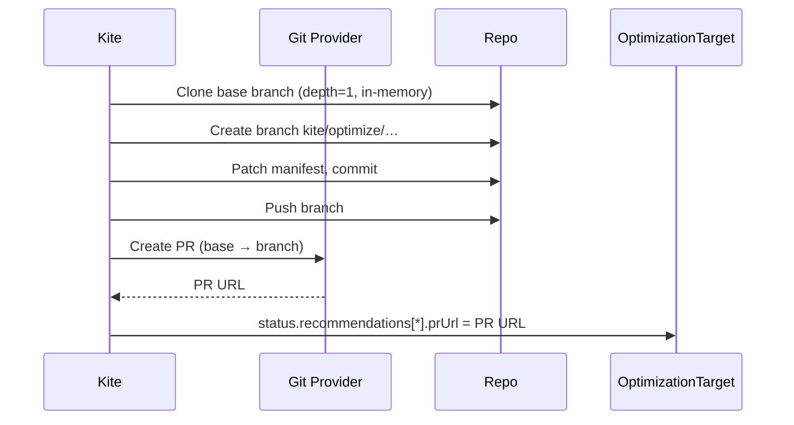

# GitOps Integration

Kite can automatically open pull requests in your GitOps repository whenever
it computes a new recommendation.  The target manifest is patched in-place
with the updated `resources.requests` and `resources.limits` values.

## Supported providers

| Provider | Field value | Authentication |
|----------|-------------|----------------|
| GitHub | `github` | Personal access token (PAT) |
| GitLab | `gitlab` | Personal access token |
| Self-hosted GitLab | `gitlab` | PAT + `baseURL` (contact maintainers) |

---

## Authentication

Kite reads the git token from a `Secret` in the **operator's namespace**
(`kite-system` by default).  The secret must contain a key named `token`.

=== "GitHub"

    ```bash
    # Create a PAT at https://github.com/settings/tokens
    # Required scopes: repo (read + write)
    kubectl create secret generic github-token \
      --from-literal=token=ghp_YOUR_TOKEN \
      -n kite-system
    ```

=== "GitLab"

    ```bash
    # Create a PAT at https://gitlab.com/-/profile/personal_access_tokens
    # Required scopes: api (read_repository + write_repository)
    kubectl create secret generic gitlab-token \
      --from-literal=token=glpat-YOUR_TOKEN \
      -n kite-system
    ```

Then reference the secret in your `OptimizationTarget`:

```yaml
gitOps:
  provider: github
  repoURL: "https://github.com/my-org/my-infra"
  secretRef:
    name: github-token          # Secret in kite-system namespace
```

---

## How Kite patches manifests

For each workload with a recommendation, Kite:

1. **Reads** the file at `pathTemplate` from the default (base) branch.
2. **Patches** the `resources.requests` and `resources.limits` of the matching
   containers.
3. **Commits** the change to a new branch:
   `kite/optimize/<kind>-<namespace>-<name>-<timestamp>`
4. **Opens a PR** targeting `baseBranch`.

### Supported manifest formats

| Format | Supported |
|--------|-----------|
| Kubernetes `Deployment` YAML | ✅ |
| Kubernetes `StatefulSet` YAML | ✅ |
| Kubernetes `DaemonSet` YAML | ✅ |
| Raw `CronJob` / `Job` | ✅ |
| Helm `values.yaml` | ❌ (planned) |
| Kustomize overlays | ❌ (use the base manifest) |

!!! warning "Comment preservation"
    The manifest is parsed and serialised through JSON, which does not preserve
    YAML comments.  If comment preservation is important to you, review the PR
    before merging and consider using a `sed`-based post-hook.

---

## PR lifecycle



The PR URL is stored in `status.recommendations[*].prUrl` so you can find it:

```bash
kubectl get ot my-target \
  -o jsonpath='{range .status.recommendations[*]}{.name}{" "}{.prUrl}{"\n"}{end}'
```

---

## Auto-merge

When `autoMerge: true` Kite will attempt to merge the PR immediately after
creating it.  This requires that:

- The token has write access to the repository.
- No branch protection rules block immediate merges.
- For GitHub: squash merge is used.

!!! danger "Production use"
    Auto-merge is powerful but risky for production workloads.  Consider
    keeping `autoMerge: false` and reviewing PRs manually, at least initially.

---

## Multiple workloads, one run

Kite creates **one PR per workload** to keep diffs small and reviewable.
Each PR targets the same base branch and has the same labels.

If a workload already has an open Kite PR (same branch name prefix), Kite
will create a new PR on a timestamped branch rather than overwriting the
existing one.

---

## Example GitOps config

```yaml
gitOps:
  provider: github
  repoURL: "https://github.com/acme/platform-infra"
  baseBranch: main
  secretRef:
    name: github-token
  pathTemplate: "apps/production/{{.Namespace}}/{{.Name}}/deployment.yaml"
  prTitleTemplate: "chore(kite): optimize {{.Kind}} {{.Namespace}}/{{.Name}}"
  prLabels:
    - kite
    - automated
    - resource-management
  reviewers:
    - acme-platform-team
  autoMerge: false
  commitMessageTemplate: "fix(resources): apply kite rightsizing for {{.Namespace}}/{{.Name}}"
```
