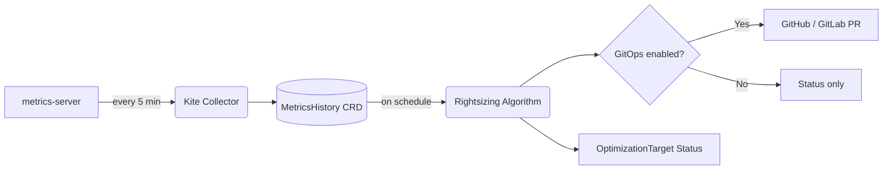

# Kite — Kubernetes Resource Rightsizing Operator

**Kite** is a Kubernetes operator that automatically analyses the CPU and memory
usage of your workloads and recommends — or directly applies — right-sized
resource requests and limits.

Unlike CLI tools that require Prometheus, Kite uses the **Kubernetes
metrics-server** that ships with most managed clusters, stores its own history
window, and integrates natively with your GitOps workflow by opening pull
requests on GitHub or GitLab.

---

## Key features

| Feature | Description |
|---------|-------------|
| **No Prometheus required** | Kite collects metrics directly from the metrics-server and builds its own history window |
| **CRD-driven** | A single `OptimizationTarget` resource declares what to analyse, how, and where to push recommendations |
| **HPA-aware** | Workloads managed by a `HorizontalPodAutoscaler` are handled correctly: recommendations are based on per-replica usage |
| **GitOps-native** | Automatically opens pull requests on GitHub or GitLab with the updated `requests` and `limits` values |
| **Dry-run mode** | Compute and inspect recommendations without touching any repository |
| **Configurable algorithm** | Tune the percentile, safety margin, history window, and limit ratios per target |

---

## How it works



1. **Collect** – Kite scrapes the metrics-server on a configurable interval
   (default: 5 minutes) and stores per-replica CPU/memory observations in
   `MetricsHistory` CRDs.
2. **Analyse** – On the configured cron schedule Kite runs the rightsizing
   algorithm over the accumulated history and computes recommended
   `requests` and `limits` for every container.
3. **Report** – Recommendations are written to the `OptimizationTarget` status.
4. **Act** – If GitOps integration is configured, Kite opens a pull request
   in your infrastructure repository with the patched manifest.

---

## Quick example

```yaml
apiVersion: optimization.kite.dev/v1alpha1
kind: OptimizationTarget
metadata:
  name: my-apps
spec:
  target:
    namespaces: [production]
  schedule: "0 2 * * *"   # every day at 02:00 UTC
  rules:
    cpuPercentile: 95
    cpuSafetyMarginPercent: 15
    historyWindow: 24h
  gitOps:
    provider: github
    repoURL: "https://github.com/my-org/my-infra"
    secretRef:
      name: github-token
    pathTemplate: "apps/{{.Namespace}}/{{.Name}}/deployment.yaml"
```

**[Get started →](getting-started.md)**
